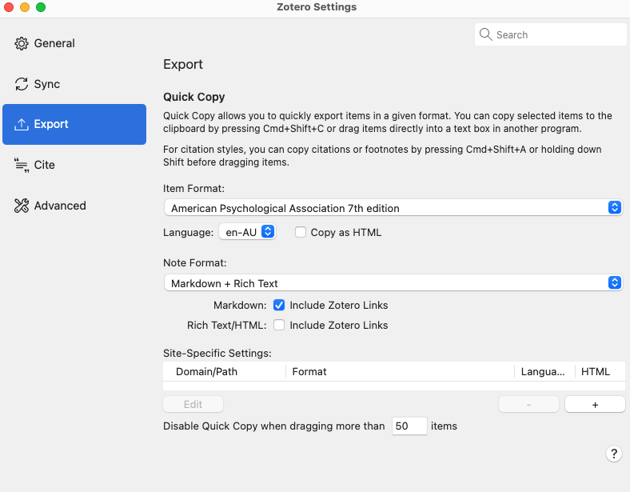
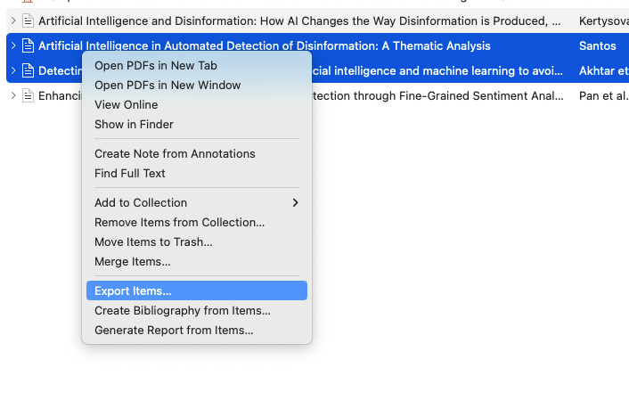
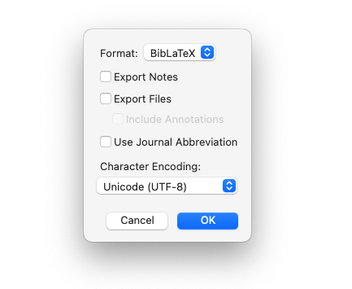

# Paper Please

This is a template I am using to create a papers for school. I uses LaTex and the APA format for references. I am also using Zotero for keeping track of the papers I am referencing.

- [Zotero](https://www.zotero.org/)
- [LaTeX Binaires](https://www.latex-project.org/get/)

## Export References to .Bib File

To use references in your paper, you need to export them from Zotero:







## Create the PDF

To "compile" the paper, make sure you have the _LaTeX Binaires_ above installed on your system (you can check with `pdflatex --version`), then run:

```bash
make build
```

🤞
